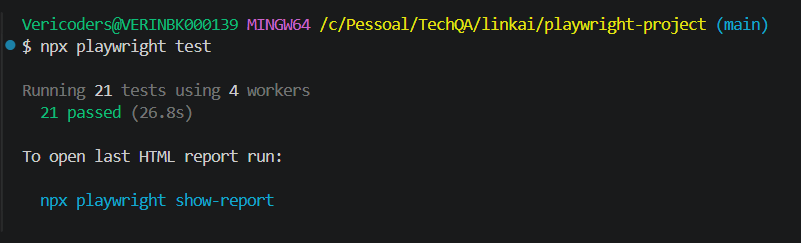
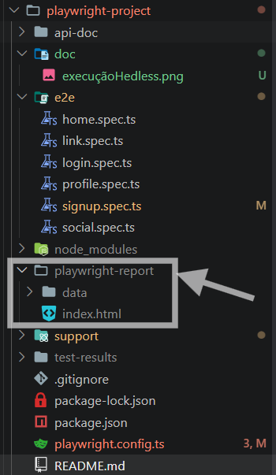
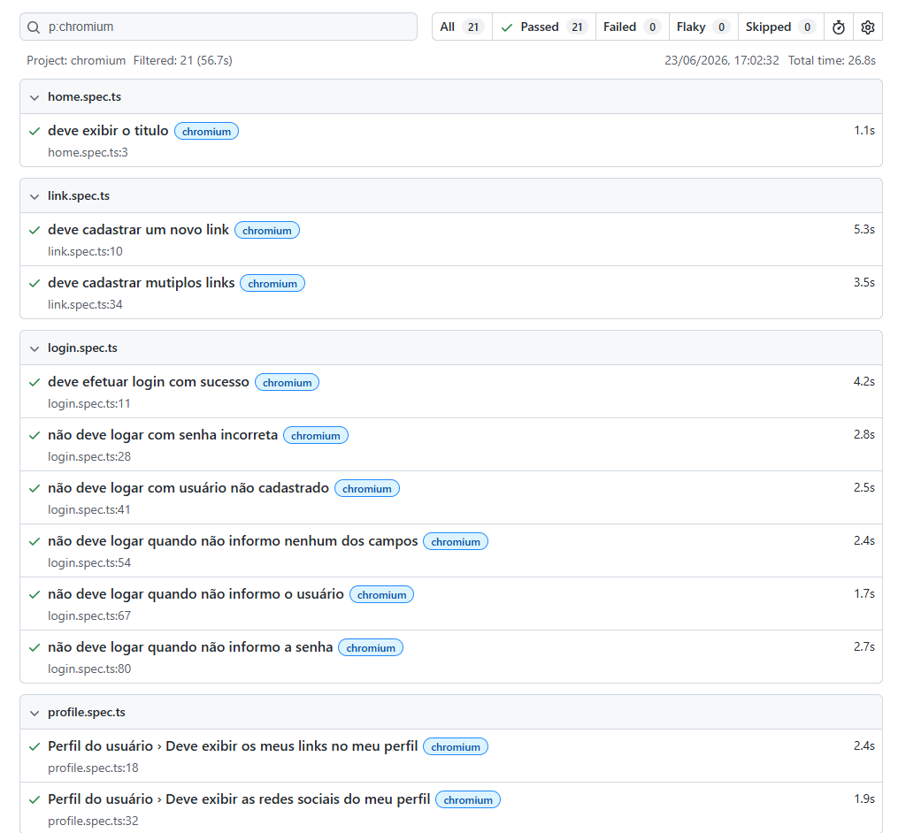
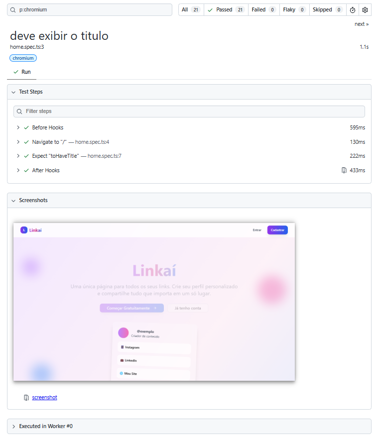
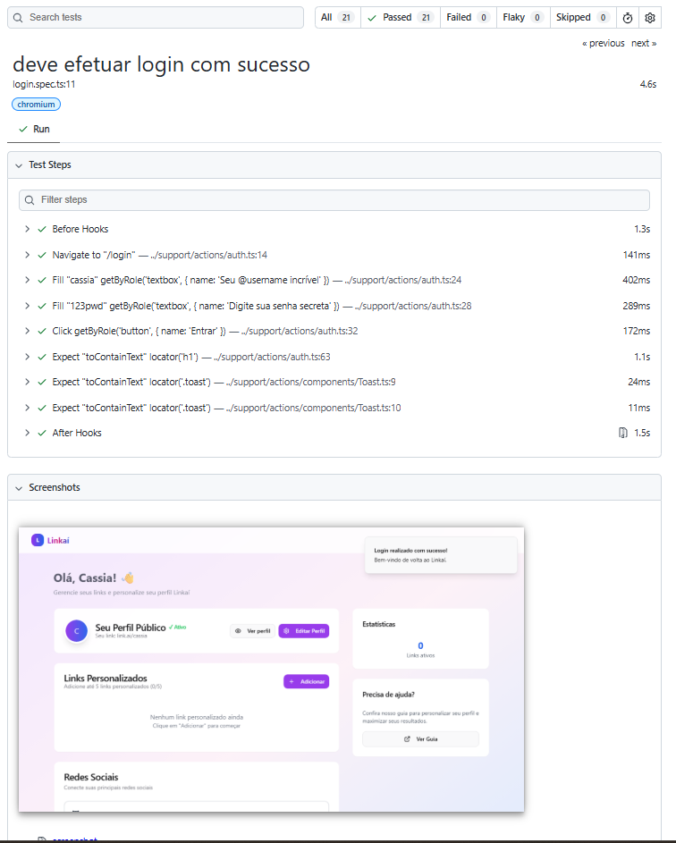

# 🎭 Linkaí - Automação de Testes com Playwright

Este repositório contém a suíte de testes automatizados do projeto Linkaí, um gerenciador de links pessoais que integra uma API REST (**Node.js**), banco de dados NoSQL (**MongoDB**) e um Frontend Web (**React/Vite**).

O projeto contempla tanto testes End-to-End (E2E) da interface *WEB* quanto testes de *API*, utilizando **Playwright** e **TypeScript** para validação dos fluxos críticos da aplicação.

Além da automação dos cenários funcionais, foram aplicados conceitos de gerenciamento de massa de dados, integração com banco de dados, consumo de **APIs REST**, geração dinâmica de dados com **Faker.js**, criptografia de senhas com **bcryptjs** e utilização do **Bruno** para documentação e validação dos endpoints da API.

A preparação dos cenários é realizada através de operações de inserção e remoção de registros diretamente no **MongoDB**, garantindo independência e confiabilidade na execução dos testes.

A arquitetura do projeto evoluiu de um modelo tradicional baseado em **Page Objects** para uma abordagem orientada a *funcionalidades (Feature-Based Actions)*, além da implementação de uma camada voltada para consumo e validação de serviços da API.

---

## 🧪 Escopo dos Testes

O projeto contempla dois tipos principais de automação:

### 🌐 Testes E2E Web
Validação dos fluxos críticos da interface do usuário, garantindo a integração entre Frontend, Backend e Banco de Dados.

Cobertura atual:
- Cadastro de usuários
- Login
- Gerenciamento de links
- Redes sociais
- Página inicial

### 🔌 Testes de API
Validação direta dos endpoints da aplicação utilizando Playwright.

Cobertura atual:
- Autenticação
- Perfil do usuário
- Consumo de endpoints REST
- Validações de status code e payloads

Os cenários utilizam preparação e limpeza de dados diretamente no MongoDB para garantir independência entre execuções.

---

## 🎯 Objetivos de Aprendizagem

Durante esta jornada estou praticando e consolidando conhecimentos em:

- Automação E2E com Playwright
- TypeScript aplicado à automação de testes
- Estruturação de projetos de testes
- Page Object por funcionalidade
- Componentização de elementos
- Gerenciamento de massa de testes
- Geração dinâmica de dados com **Faker.js**
- Delete e Insert de massas direto no Banco de Dados usando o **MongoDB**
- Boas práticas de automação
- utilização do **bcrypt.js**
- Consumo de APIs REST
- Automação de testes de API com Playwright
- Utilização do Bruno para documentação e validação de endpoints
- Manipulação de Arrays e Loops para execução de cenários em massa
- Configurando as Specs para executra paralelamento e de forma serial
- Configurando a URL base na raiz do projeto (playwright.config.ts)
- Geração do relatório nativo do Playwright
- Inclusão dos screenshot no relatorio para qualquer resultado da execução seja **Sucesso** ou **Falha**
- Geração do video no relatório

---

## 📐  Arquitetura e Padrões Aplicados

O projeto utiliza uma abordagem híbrida baseada em:

- Feature-Based Actions
- Componentização de elementos reutilizáveis
- Externalização de massa de testes
- Data Driven Testing
- Tipagem forte com TypeScript
- Integração com MongoDB para preparação de cenários
- Geração dinâmica de dados com Faker.js
- Data Driven Testing com Arrays e Loops
- Camada de consumo de APIs REST
- Automação de testes de API utilizando Playwright Request API
- Documentação e coleções de API com Bruno
- Configurando a Spec de Profile e Social para executar de forma serial, devido a dependencia da massa
- Configurando a URL base na raiz do projeto (playwright.config.ts)
- geração do relatório nativo do Playwright
- Configuração de video no relatório

Essa estrutura reduz o acoplamento dos testes à interface e melhora a manutenção da suíte de automação.

---

## 🛠️ Tecnologias e Ferramentas

- [TypeScript](https://www.typescriptlang.org/)
- [Playwright](https://playwright.dev/)
- [Node.js](https://nodejs.org/)
- [Docker](https://www.docker.com/) (para o Banco de Dados)
- **CI/CD:** GitHub Actions
- [Fakerjs](https://fakerjs.dev/) (Gere grandes quantidades de dados falsos (mas realistas) para testes)
- [MongoDB](https://www.mongodb.com) (delete e insert de massa de dados) 
- [bcryptjs](https://www.npmjs.com/package/bcryptjs)
- [bruno](https://www.usebruno.com/) (Documentação e validação de APIs)

---

## Progresso da Jornada

### ✅ Iniciando com Playwright

- [x] Primeiros passos com Playwright
- [x] Estrutura inicial do projeto
- [x] Testes Sincronizados com o código
- [x] Test Generator
- [x] Cobertura de Testes

### ✅ Estrutura, Reuso e Massa de Testes

- [x] Page Objects
- [x] Components
- [x] Interfaces
- [x] Externalização da Massa de Teste
- [x] Deu ruim na massa de Testes
- [x] Faker.js

### ✅ Boas Práticas e Integrações

- [x] Melhorando a legibilidade
- [x] Como Validar os Atributos dos Elementos?
- [x] Massa de Testes com Novas Propriedades
- [x] Boas Práticas na Separação de Interfaces
- [x] O que nunca fazer com Page Objects
- [x] Conectando Testes ao Banco de Dados
- [x] Testes Independentes
- [x] Boas práticas & Custom Actions

### ✅ Testes finais, recursos extras, configurações e encerramento

- [x] Cadastros com Arrays e Loops
- [x] Testando o Cadastro de Redes Sociais
- [x] Consumindo a API
- [x] Construindo a Camada de Serviços
- [x] Nova Versão, Nova Regressão
- [x] Cada Escolha é uma Renúncia
- [x] Configurando URL Base
- [x] Regressão pela CLI e Screenshots
- [x] Evidencias em Video
- [ ] Encerramento

---

## 📁 Estrutura do Projeto

```text
playwright-project/
├── api-doc/                ← Pasta onde se encontram as api's do projeto
│   ├── Auth/          
│   ├── enviroments 
│   ├── Links
│   ├── social 
│   └── bruno.json   
├── e2e/                    ← Scripts de testes automatizados (.spec.ts)
│   ├── home.spec.ts        ← Testes E2E Web - Dados da Home
│   ├── link.spec.ts        ← Testes E2E Web - cadastro de links
│   ├── login.spec.ts       ← Testes E2E Web - acesso ao login
│   ├── profile.spec.ts     ← Testes de API
│   ├── signup.spec.ts      ← Testes E2E Web - cadastro de usuários
│   └── social.spec.ts      ← Testes E2E Web - cadastro de links  
├── playwright-report/      ← Relatórios HTML gerados após a execução via hedless
│   ├── data/               ← onde se encontra os screenshots dos testes
│   │   └── ....png
│   └── index.html          ← onde se encontra o relatório gerado na execução hedless
├── support/   
│   ├── actions/            ← onde se encontra as informações das funcionalidades
│   │   ├── components      ← onde se encontra as informações dos elementos que são gerais para o portal
│   │   |   └── Toast.ts
│   │   ├── auth.ts
│   │   ├── link.ts
│   │   └── social.ts
│   ├── fixtures/           ← onde se encontra as informações das massas de teste
│   │   └── User.ts         ← massas de teste de Login  
│   ├── database.ts/        ← onde se encontra as informações do banco de dados para remover o usuário de teste
│   └── service.ts/         ← onde se encontra as informações ddo serviço
├── test-results/           ← Artefatos dos casos de testes (screenshots, vídeos)
├── package-lock.json       ← Gerenciamento de dependências e scripts
├── package.json            ← Gerenciamento de dependências e scripts
├── playwright.config.ts    ← Configurações globais do Playwright
└── README.md               
```

---

## 🚀 Pré-requisitos para Execução

Antes de iniciar os testes, é necessário que o ambiente completo do **Linkaí** esteja rodando localmente.

### 1. Banco de Dados (Docker)
Na raiz da pasta `linkai/apps`, inicie os serviços de banco de dados:
```bash
docker-compose up -d
```

### 2. API (Backend)
Em um novo terminal, acesse `linkai/apps/api`:
```bash
npm install   # Caso seja a primeira execução
npm run dev
```

### 3. Web App (Frontend)
Em outro terminal, acesse `linkai/apps/web`:
```bash
npm install   # Caso seja a primeira execução
npm run dev
```
> A aplicação deverá estar disponível em: `http://localhost:3000`

---

## 🧪 Executando os Testes

Com a aplicação rodando, acesse a pasta `linkai/playwright-project` e utilize os comandos abaixo:

### Instalação de dependências do Playwright
```bash
npm install
npx playwright install --with-deps
```

### Comandos Principais
| Comando | Descrição |
| :--- | :--- |
| `npx playwright test` | Executa todos os testes em modo headless (sem interface) |
| `npx playwright test --headed` | Executa os testes exibindo o navegador |
| `npx playwright test --ui` | Abre a interface interativa do Playwright (recomendado) |
| `npx playwright test --debug` | Abre o Inspetor do Playwright para depuração passo a passo |
| `npx playwright show-report` | Abre o último relatório de testes gerado |
| `npx playwright codegen http://localhost:3000/login` | abre o navegador e o generator para gerar o teste |

---

## Visualização do Relatório da execução

para gerar o relatorio é necessário executar o comando:

### Execução da automação via hedless
```bash
npx playwright test
```
ou 
```bash
npx playwright show-report
```


### Relatório em HTML
Após a execução será gerado o relatório na pasta *\playwright-report*.<br>
**Obs.:** Nessa pasta também ficará armazenado os screenshots de todos os testes.<br>


### Apresentação do Relatório
Abrindo o relatório no navegador a visualização será essa:



Ao clicar no caso de teste




---

## 📚 Material de Apoio

As anotações, resumos e conteúdos teóricos desta jornada estão centralizados no repositório:

👉 [jornada_TechQa](https://github.com/CassiaCaris/jornada_TechQa)

Este repositório contém apenas a implementação prática dos conceitos estudados durante a jornada.

---

## 📈 Evolução do Projeto

Este projeto está sendo construído gradativamente durante a Jornada TechQA e será utilizado como laboratório para aplicação prática dos conceitos aprendidos.

A cada módulo concluído, novas funcionalidades, padrões e melhorias serão incorporadas ao framework.

---

## 📚 Referências Úteis

- [Documentação Oficial Playwright](https://playwright.dev/docs/intro)
- [Melhores Práticas em Seletores](https://playwright.dev/docs/locators)
- [Guia de Instalação Docker (WSL2)](https://dev.to/papitofernando/instalando-o-docker-no-windows-10-home-ou-professional-com-wsl-2-26m3)
- [Documentação Oficial do Fakerjs](https://fakerjs.dev/)
- [Documentação Oficial do Node para MongoDB](https://www.npmjs.com/package/mongodb)
- [Documentação MongoDB](www.mongodb.com)
- [Documentação Oficial do Node para o bcryptjs](https://www.npmjs.com/package/bcryptjs)
- [bruno](https://www.usebruno.com/) (Documentação e validação de APIs)